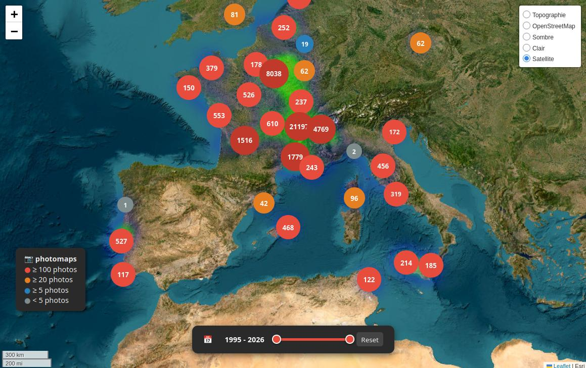

# photomaps

Interactive heatmap of your photo library, generated from GPS EXIF metadata.
Built for Synology NAS + nginx, served as a standalone HTML file.



## Features

- Heatmap + clustered markers with photo counts
- Popup with year/month/day tree, links to Google Photos by date
- Year range slider to filter markers and heatmap in real time
- Multiple tile layers: Satellite, OpenStreetMap, Clair, Sombre, Topographie
- Incremental cache: only rescans new files and files previously without GPS
- Batch processing with intermediate cache saves (crash-safe)

## Requirements

- Python 3.8+
- [exiftool](https://exiftool.org/) in PATH
- `folium` Python package

```bash
python3 -m pip install folium
```

## Configuration

Copy `.env.example` to `.env` and edit:

```bash
cp .env.example .env
```

| Variable          | Description                              | Default                        |
|-------------------|------------------------------------------|--------------------------------|
| `PHOTO_ROOT`      | Root folder to scan                      | `/volume1/photo`               |
| `EXCLUDE_SUBDIRS` | Comma-separated subfolders to exclude    | `misc`                         |
| `CACHE_FILE`      | Path to GPS cache JSON                   | `cache.json` (next to script)  |
| `OUTPUT_FILE`     | Path to generated HTML map               | `/volume1/docker/nginx/conf/photomaps/maps.html` |

CLI arguments always override `.env` values.

## Usage

### First run — full scan

Scans all media files, saves cache, generates map:

```bash
python3 photomaps.py
```

### Extract only (no map generation)

Useful for long scans — saves cache after each batch of 2000 files:

```bash
python3 photomaps.py --extract-only
```

### Generate map from existing cache

Fast — no file scanning:

```bash
python3 photomaps.py --from-cache
```

### Incremental update

Rescans only new files and files previously without GPS (e.g. after adding GPS in digiKam):

```bash
python3 photomaps.py --incremental
```

### Test on a subfolder

```bash
python3 photomaps.py --path /volume1/photo/2024 --output /tmp/maps_test.html
```

### All options

```
--path PATH        Root folder to scan (overrides PHOTO_ROOT)
--output PATH      Output HTML file (overrides OUTPUT_FILE)
--cache PATH       Cache file path (overrides CACHE_FILE)
--extract-only     Scan and save cache, do not generate map
--from-cache       Load cache and regenerate map, no scan
--incremental      Scan only new + no-GPS files, merge with cache
```

## nginx configuration

Mount your photomaps output folder into the nginx container and add:

```nginx
location /photomaps/ {
    alias /etc/nginx/conf.d/photomaps/;
    index maps.html;
    autoindex on;
}
```

## Workflow with digiKam

1. Assign GPS coordinates in digiKam
2. Enable **Settings → Metadata → Delegate to ExifTool backend** (required for video files)
3. Run **Item → Write Metadata to Files** on your full library
4. Run `python3 photomaps.py --incremental` to update the cache and map

## Cache format

The cache is a JSON file with two lists:

- `records`: files with valid GPS — `{lat, lon, date, path}`
- `no_gps`: file paths without GPS (rescanned on each `--incremental`)

Files already confirmed with GPS are never rescanned, making incremental updates fast even on large libraries.
